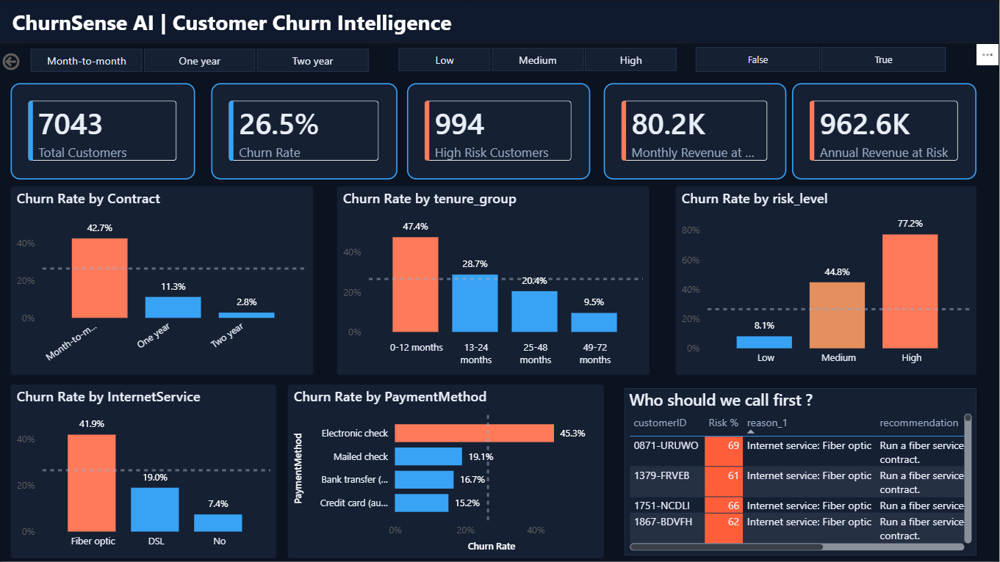
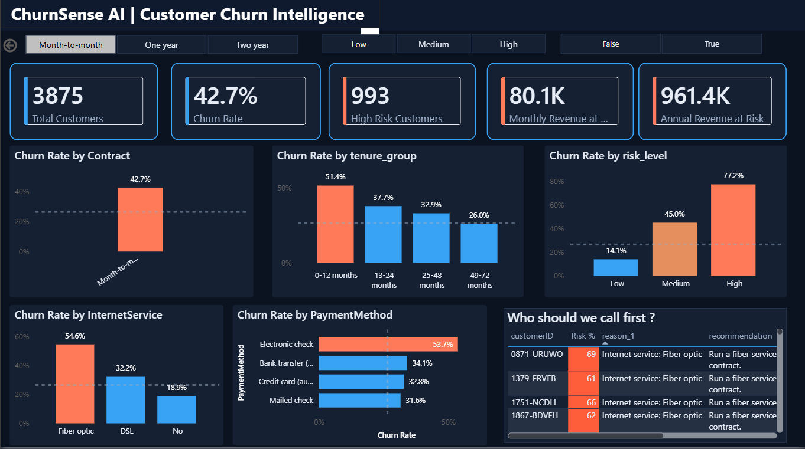
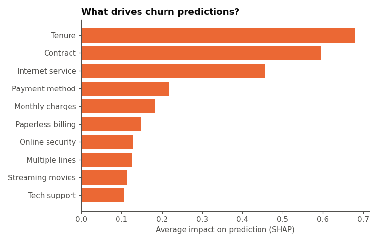

# ChurnSense AI: Customer Churn Intelligence System

An end-to-end data analyst project that answers three business questions for a telecom company:

1. **Who is leaving?** (SQL + EDA)
2. **Who is likely to leave next, and why?** (XGBoost + SHAP)
3. **What should we do about it, and how much revenue is at stake?** (recommendations + Power BI dashboard)

**Tools:** SQL (SQLite) · Python (pandas, scikit-learn, XGBoost, SHAP) · Power BI · Google Gemini (LLM, optional layer)

---

## Dashboard





The Power BI file is in [`dashboard/ChurnSense_Dashboard.pbix`](dashboard/ChurnSense_dashboard.pbix). It has KPI cards, churn charts, slicers (Contract, Risk level, Unseen customers only) and a call list titled **"Who should we call first?"**, sorted by churn risk.

---

## Business problem

Losing a customer costs more than keeping one. In this data, customers who left were paying **$139,131 of the $456,117** monthly revenue (about 30%). The goal is to find customers at risk early, understand the reasons, and give the retention team a prioritised list with a suggested action for each customer.

## Dataset

[IBM Telco Customer Churn](https://www.kaggle.com/datasets/blastchar/telco-customer-churn): 7,043 customers, 21 columns, **26.5% churn (1,869 customers)**.

Cleaning notes:
- `TotalCharges` was stored as text and had 11 blank values. All 11 customers had tenure 0 and had not churned, so they were handled as new customers.
- No missing values or duplicates elsewhere.
- Added `churn_flag` (1 = left, 0 = stayed) and `tenure_group`.

---

## Key findings (from SQL and EDA)

| Question | Finding |
|---|---|
| Contract type | Churn is **42.7%** on month-to-month, 11.3% on one-year and **2.8%** on two-year contracts |
| Tenure | The newest customers churn at **47.4%**; the longest-tenure group churns at **9.5%** |
| Internet service | Fiber optic customers churn at **41.9%**, versus 19.0% on DSL and 7.4% with no internet |
| Tech support | Customers with internet but **no tech support** churn at **41.6%**, versus 15.2% with it |
| Payment method | Electronic check customers churn at **45.3%**; the other three methods are between 15.2% and 19.1% |
| High-risk segment | Month-to-month, tenure of 12 months or less, no tech support: **1,363 customers, 61.0% churn** |

All ten queries are in [`sql/churnsense_queries.sql`](sql/churnsense_queries.sql).

---

## Machine learning

Three models were trained on an 80/20 stratified split (`random_state=42`) and compared.

| Model | ROC-AUC |
|---|---|
| Logistic Regression | 0.842 |
| Random Forest | 0.843 |
| **XGBoost (chosen)** | **0.846** |

**Class imbalance:** a model that always predicts "stay" is 73.5% accurate but catches no churners, so accuracy alone was not used.

**Threshold:** the decision threshold was lowered to **0.30** so the model catches more customers who will leave. On the unseen test set this gives **recall 0.765 and precision 0.524** (confusion matrix `[[775, 260], [88, 286]]`). The trade-off is more false alarms, which is acceptable because a retention call is cheap compared with a lost customer.

**Risk bands** (churn probability): Low ≤ 30, Medium > 30 to ≤ 60, High > 60. On customers the model had **not seen**:

| Risk band | Customers | Actual churn rate |
|---|---|---|
| Low | 863 | 10.2% |
| Medium | 353 | 41.1% |
| High | 193 | 73.1% |

The bands separate real risk well: high-risk customers actually churned about seven times as often as low-risk ones.

## Explainability (SHAP)

SHAP values show *why* each customer is flagged. Dummy-encoded columns were grouped back to their original column so the results are readable.

Top drivers (mean absolute SHAP): **tenure (0.68), Contract (0.60), InternetService (0.46), PaymentMethod (0.22), MonthlyCharges (0.18)**.



---

## Revenue at risk

Across all customers, **994 are High risk**:

- **$80,219 per month** and about **$962,632 per year** in charges
- **17.6%** of total monthly charges
- 993 of the 994 are on month-to-month contracts

---

## Recommendations

Every customer gets a **rule-based recommendation** built from their top SHAP reasons and an approved list of retention actions (no invented discounts or prices).

Example report:

```
Customer ID: 5178-LMXOP
Churn Probability: 94%  (High risk)
Main Reasons:
  - Tenure: 1 month
  - Internet service: Fiber optic
  - Contract: Month-to-month
Recommendation (rule-based): Schedule an onboarding check-in call and run a fiber service-quality review.
```

**LLM layer (Gemini):** the project also includes a function that sends a customer's reasons and the approved action list to Gemini and asks for a short, grounded recommendation. It was tested on a few example customers. The free-tier daily quota was used up during testing, so the recommendations for all customers come from the rule-based system, and the LLM step is an optional add-on rather than the core pipeline. The API key is read from Colab Secrets and is never stored in this repo.

---

## Recommended business actions

1. Offer **contract upgrade incentives** to month-to-month customers, especially in their first year.
2. Run an **onboarding check-in** for customers in their first months.
3. Review **fiber service quality**, since fiber has the highest churn among internet customers.
4. Bundle **tech support** for customers who have internet without it.
5. Move customers off **electronic check** toward automatic payment methods.
6. Use the **"Who should we call first?"** list to prioritise outreach by risk.

---

## Project structure

```
churnsense-ai/
├── README.md
├── .gitignore
├── notebooks/        # Colab notebook (cleaning, EDA, model, SHAP, recommendations)
├── data/             # Raw, cleaned, predictions, insights and Power BI CSVs
├── database/         # churnsense.db (SQLite)
├── sql/              # churnsense_queries.sql (10 queries)
├── model/            # Trained XGBoost model and column list (joblib)
├── charts/           # EDA and SHAP charts
└── dashboard/        # ChurnSense_Dashboard.pbix + screenshots
```

## How to run

1. Open the notebook in `notebooks/` in Google Colab.
2. Upload `Telco-Customer-Churn.csv` from `data/`.
3. Run the cells from top to bottom.
4. (Optional) To try the LLM step, add your own `GEMINI_API_KEY` to Colab Secrets.
5. Open `dashboard/ChurnSense_Dashboard.pbix` in Power BI Desktop to explore the dashboard.

## Limitations

- The dataset is a public sample, not live company data.
- The model finds patterns linked to churn but does not prove what *causes* it.
- Lowering the threshold to 0.30 trades precision for recall, so some flagged customers would have stayed anyway.
- The retention actions are suggestions and have not been tested in a real campaign.

---

**Author:** Ashok S · B.Tech Artificial Intelligence and Data Science · Salem, Tamil Nadu, India
**Contact:** add your LinkedIn and email here
